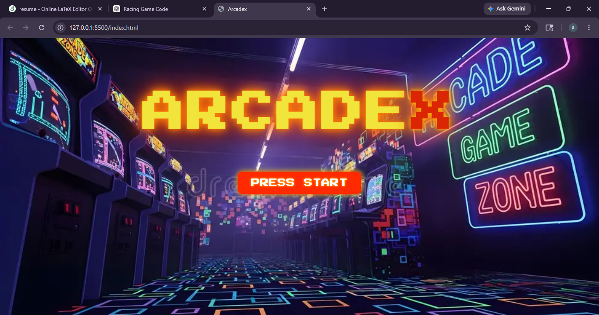
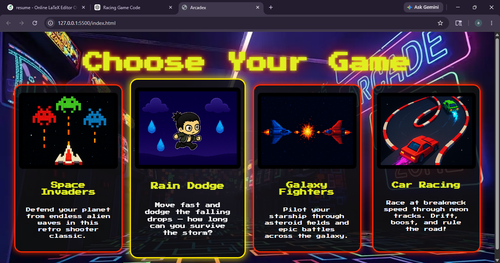
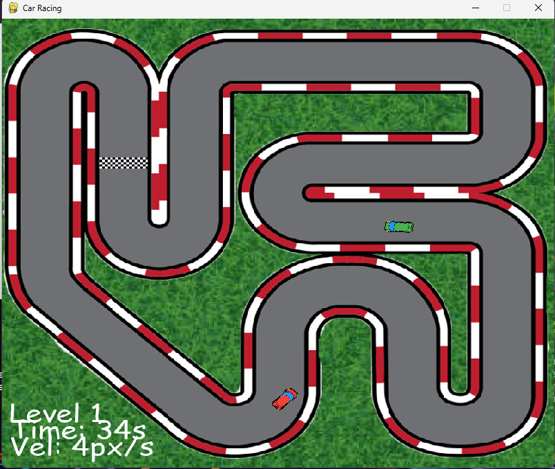
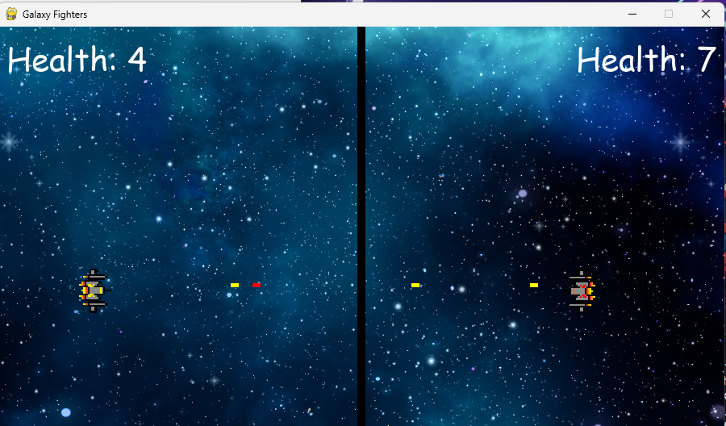
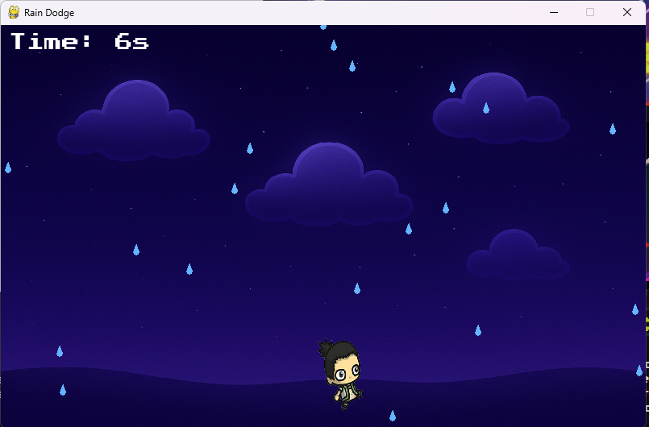
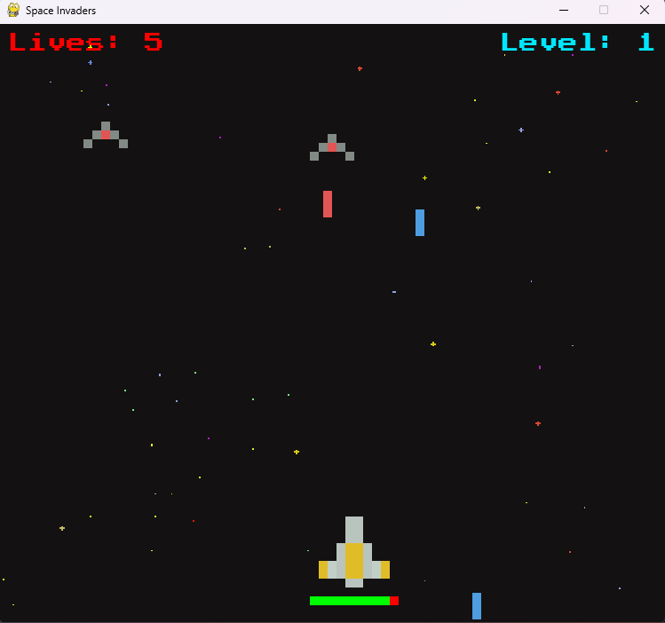

# 🕹️ ArcadeX

**ArcadeX** is a digital game portal website that brings together multiple Python Pygame games under a single unified web interface. Users can browse the game collection and launch any game directly from the browser — all from one place.

---

## 📸 Screenshots

| | |
|---|---|
| 🖥️ **Website Homepage** |  |
| 🖥️ **Portal Games Section** |  |
| 🚗 **Car Racing** |  |
| 🚀 **Galaxy Fighters** |  |
| 🌧️ **Rain Dodge** |  |
| 👾 **Space Invaders** |  |


---

## 🎮 Games

### 🚗 Car Racing
A top-down racing game where you compete against an opponent across 10 progressively harder levels.

**Concepts used:** OOP with abstract base class (`AbstractCar`) and inheritance (`PlayerCar`, `ComputerCar`) — AI pathfinding using a waypoint system where the computer car calculates steering angles with trigonometry (`math.atan`) — pixel-perfect collision detection using Pygame masks — game surface scaling to fit a fixed display window

---

### 🚀 Galaxy Fighters
A two-player space shooter split down the middle of the screen. Yellow vs Red — shoot each other down before your health runs out.

**Concepts used:** Custom Pygame events (`USEREVENT`) for bullet-hit detection — real-time health tracking and HUD rendering — two-player simultaneous input handling from the same keyboard — rectangular collision detection between bullets and ships

---

### 🌧️ Rain Dodge
Dodge falling raindrops for as long as you can. Survive longer, score higher.

**Concepts used:** Raindrops spawning at variable positions using Python's `random` module — elapsed time tracking as the score metric — sprite velocity and boundary checking — custom retro font rendering (`PressStart2P`)

---

### 👾 Space Invaders
Classic arcade-style alien shooter. Multiple enemy types descend in waves — take them all down before they reach you.

**Concepts used:** OOP with a `Spaceship` base class extended by enemy and player subclasses — wave-based enemy spawning with increasing difficulty — laser collision detection between multiple objects — lives and score system

---

## 🌐 Tech Stack

| Layer | Technology |
|-------|-----------|
| Games | Python + Pygame |
| Web Portal | HTML + CSS |
| Backend | Python Flask |
| Game Launcher | `subprocess.Popen` via Flask routes |

---

## 📁 Project Structure

```
ArcadeX/
│
├── index.html                  # Game portal webpage
├── style.css                   # Neon arcade-themed styles
├── server.py                   # Flask backend to launch games
│
├── carracing/
│   ├── car_racing.py
│   ├── utils.py
│   └── imgs/
│
├── galaxyfighters/
│   ├── galaxy_fighters.py
│   └── Assets/
│
├── raindodge/
│   ├── rain_dodge.py
│   └── imgs/
│
└── spaceinvaders/
    ├── space_invaders.py
    └── Assets/
```

---

## 🚀 Getting Started

### Prerequisites
- Python 3.x
- pip

### Installation

1. **Clone the repository**
   ```bash
   git clone https://github.com/your-username/ArcadeX.git
   cd ArcadeX
   ```

2. **Install dependencies**
   ```bash
   pip install pygame flask
   ```

3. **Start the Flask server**
   ```bash
   python server.py
   ```

4. **Open the portal**
   Open `index.html` in your browser and click any game card to launch it.

---

## ⚙️ How It Works

The portal frontend sends a request to a Flask route when a game card is clicked. Flask then uses Python's `subprocess` to launch the corresponding Pygame script as a separate process, opening the game window.

```
Browser click  →  Flask route (/run/<game>)  →  subprocess.Popen  →  Pygame window opens
```

---

## 🛠️ Future Improvements

- High score / leaderboard tracking
- More games added to the portal
- User login and profiles
- Online multiplayer support


